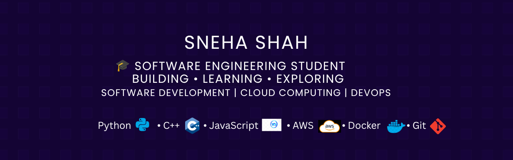

  

<h1 align="center">Hi, I'm Sneha Shah 👋</h1>

 Building backend systems and cloud-based solutions through practical projects.

---
## 👩‍💻 About Me

Software Engineering student focused on backend development, cloud computing, and DevOps.

I build REST APIs, deploy applications on AWS, and explore scalable software solutions through hands-on projects.

---

## 🛠️ Tech Stack

<table>
<tr>

<td width="50%">

### 💻 Programming Languages

- Python
- JavaScript
- C
- C++

</td>

<td width="50%">

### 🌐 Backend & Web Development

- FastAPI
- REST APIs
- HTML
- CSS

</td>
</tr>

<tr>
<td width="50%">

### ☁️ Cloud & DevOps

- AWS (EC2)
- Docker
- Nginx
- Linux
- SSL Configuration

</td>

<td width="50%">

### 🧰 Tools & Platforms

- Git
- GitHub
- VS Code

</td>
</tr>
</table>
---

## ☁️ Cloud & Backend Experience

Through academic projects and hands-on development, I have worked with:

- Deploying applications on AWS cloud platforms
- Developing REST APIs using FastAPI
- Containerizing applications with Docker
- Configuring and hosting web servers using Nginx
- Working with Linux-based server environments
- Using Git and GitHub for version control and collaboration
- Exploring modern software deployment workflows
  
# 🚀 Featured Projects

## ☁️ Cloud Application Deployment

A backend application deployed using modern cloud and DevOps practices.

### Tech:
Python | FastAPI | Docker | AWS EC2 | Nginx

### Highlights:
✓ Built REST APIs  
✓ Containerized using Docker  
✓ Deployed on AWS EC2  
✓ Configured Nginx reverse proxy

# 🏆 Certifications & Achievements

## AWS Academy Cloud Foundations

Successfully completed AWS Academy Cloud Foundations certification.

🔗 [View AWS Badge](https://www.credly.com/badges/dd68be71-ccd8-4b5d-9504-4305f7dd0f6c/public_url)

---

# 📊 GitHub Stats

 

---
## 🌱 Currently Exploring

- Cloud deployment workflows
- Backend architecture
- DevOps automation
---
# 🎯 Goals

My goal is to continuously improve my technical skills, contribute to meaningful projects, and build software solutions that create real-world impact.

---

# 📫 Connect With Me

📧 Email: [shahaneha759@gmail.com](mailto:shahaneha759@gmail.com)

---

⭐ Thanks for visiting my profile!

